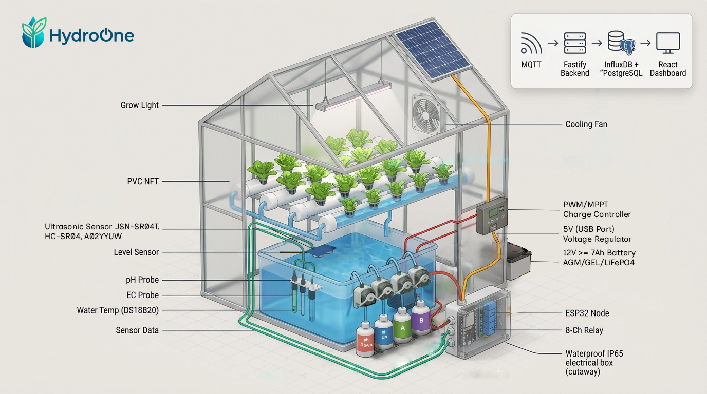

<p align="center">
  
</p>
<p align="center">
  <strong>Production-Grade Open Source IoT Hydroponic Control System</strong>
</p>

<p align="center">
  <a href="https://github.com/40rbidd3n/Hydro0x01/stargazers"></a>
  <a href="https://github.com/40rbidd3n/Hydro0x01/network/members"></a>
  <a href="https://github.com/40rbidd3n/Hydro0x01/blob/main/LICENSE"></a>
</p>

---

**HydroOne** is a robust, modular, and professional-grade hydroponic monitoring and control system. It aims to bridge the gap between hobbyist DIY setups and expensive industrial automation. Featuring a modern tech stack including MQTT, InfluxDB telemetry, and a sleek React-based dashboard.



## ✨ Features
- **Real-Time Environment Monitoring**: High-precision tracking of pH, EC, water level, temperature, and humidity.
- **Automated Actuator Control**: Smart relays for dosing pumps, main circulation, grow lights, and ventilation.
- **Secure Architecture**: Async MQTT with TLS, offline robust modes, and RSA-2048 Signed OTA updates.
- **Edge-First Local Dashboard**: Lightning fast React SPA communicating over real-time WebSockets to a Fastify backend.
- **Enterprise Data Management**: PostgreSQL for persistent config state and InfluxDB for time-series telemetry.

---

## 🏗 System Architecture

| Layer | Stack |
|:------|:------|
| **Frontend** | React 19, Vite, Tailwind CSS, Recharts, Zustand, Lucide Icons |
| **Backend** | Node.js, Fastify, Prisma ORM, Socket.io
| **Database** | PostgreSQL (relational), InfluxDB (time-series) |
| **Firmware** | C++ / Arduino, PlatformIO, Async MQTT |
| **DevOps** | Docker support, GitHub Actions, Secure OTA deployment |

<p align="center">
  
</p>

---

## 🛠 Prerequisites

Ensure you have the following installed before proceeding:
- Node.js (v20+ recommended)
- PostgreSQL (v14+)
- InfluxDB (v2.0+)
- MQTT Broker (Mosquitto/HiveMQ)
- ESP32 Development Board
- PlatformIO IDE

---

## ⚡ Quickstart & Installation

**1. Clone the repository**
```bash
git clone https://github.com/40rbidd3n/Hydro0x01.git
cd HydroOne
```

**2. Setup Backend**
Configure the environment and seed the database.
```bash
cd backend
npm install
cp .env.example .env
# Edit .env with your DB credentials and a secure JWT Secret
npx prisma db push
npm run dev
```

**3. Setup Frontend**
```bash
cd ../frontend
npm install
cp .env.example .env
npm run dev
```

**4. Build & Flash Firmware**
Review the [Hardware Setup](docs/02_HARDWARE_SETUP.md) and connect your sensors to the ESP32. Then configure `firmware/include/config.h` and upload the firmware.
```bash
cd ../firmware
# Edit platformio.ini to choose your hardware environment (e.g., env:esp32_dht_bmp)
pio run -t upload
```

---

## 📖 Documentation

Explore our comprehensive guides located in the `docs/` folder:

| # | Guide | Description |
|:-:|:------|:------------|
| 1 | [System Overview](docs/01_SYSTEM_OVERVIEW.md) | How everything connects |
| 2 | [Hardware Setup](docs/02_HARDWARE_SETUP.md) | Wiring diagrams and assembly |
| 3 | [Firmware Guide](docs/03_FIRMWARE_GUIDE.md) | Configuration and flashing |
| 4 | [Integration Guide](docs/04_INTEGRATION_GUIDE.md) | Home Assistant, Telegram & Discord |
| 5 | [Calibration Guide](docs/05_CALIBRATION_GUIDE.md) | Sensor tuning procedures |
| 6 | [Troubleshooting](docs/06_TROUBLESHOOTING.md) | Common issues and fixes |
| 7 | [API Reference](docs/07_API_REFERENCE.md) | REST API documentation |
| 8 | [MQTT Guide](docs/MQTT_GUIDE.md) | Topics and payload specifications |
| 9 | [Security & OTA](docs/08_SECURITY_OTA.md) | Firmware signing and RSA keys |

---

## 🚑 Troubleshooting

- **Database Errors**: Ensure you have run `npx prisma generate` and your credentials in `.env` are accurate.
- **MQTT Connectivity**: Ensure you are using `mqtts://` if using port 8883, and check your base topic.
- **Sensor Readings**: Refer to [Troubleshooting Docs](docs/06_TROUBLESHOOTING.md) for I2C and ADC calibration solutions.

---

## 🤝 Contributing

We actively welcome community contributions to improve HydroOne! Please see our [**Contributing Guidelines**](CONTRIBUTING.md) and our [**Code of Conduct**](CODE_OF_CONDUCT.md) before submitting pull requests.

## 📄 License

This project is licensed under the **MIT License**. See the [LICENSE](LICENSE) file for more details.

## 💬 Support & Contact

If you have a feature request or found a bug, please use the [GitHub Issue Tracker](https://github.com/40rbidd3n/Hydro0x01/issues). 

<p align="center">
  Built with ❤️ for the future of sustainable farming.
</p>