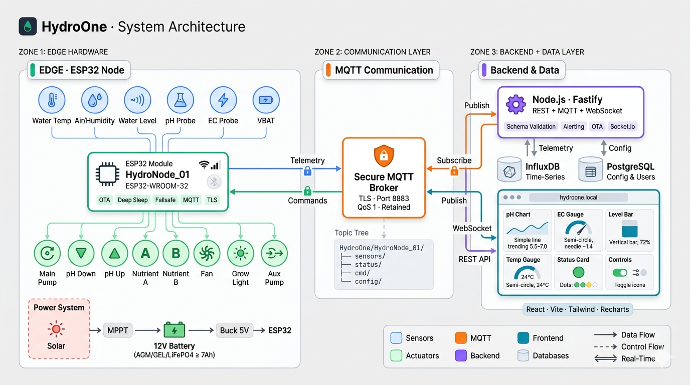

# System Overview

HydroOne is a professional-grade, open-source IoT hydroponic control system. It is designed to bridge the gap between hobbyist DIY projects and industrial automation.

*Figure 1: High-level System Architecture*

## 🏗️ Core Architecture

The system is divided into four main layers:

### 1. Edge Layer (ESP32 Firmware)
Our custom firmware is built for the **ESP32**. It handles sensor acquisition, local calibration logic, and direct relay control. It features a modular sensor architecture that avoids heap fragmentation.

### 2. Communication Layer (MQTT)
Data is moved across the system using the **MQTT** protocol. This ensures low-latency, reliable delivery of telemetry and commands, even in poor network conditions typical of greenhouses.

### 3. Data & API Layer (Node.js/Fastify)
The backend acts as the brain of the system:
- **Telemetry Ingest**: Validates and routes sensor data to **InfluxDB**.
- **State Management**: Manages device settings and logs via **PostgreSQL (Prisma)**.
- **Command Dispatch**: Routes user actions from the dashboard to the devices.

### 4. Presentation Layer (React/Vite)
A modern, responsive dashboard built with React 19 and Vite. It providing real-time visualization of your grow environment and full remote control over your hardware.

## 📡 What's Inside?

For a deeper dive into each component, refer to the technical reference:
- 🛠️ [**Backend Technical Reference**](./reference/BACKEND.md)
- ⚛️ [**Frontend Technical Reference**](./reference/FRONTEND.md)
- 📡 [**Network Topology Map**](../README.md#tech-stack)

---

### Next Steps:
Ready to build? Move on to [**Step 2: Hardware Setup**](./02_HARDWARE_SETUP.md).
