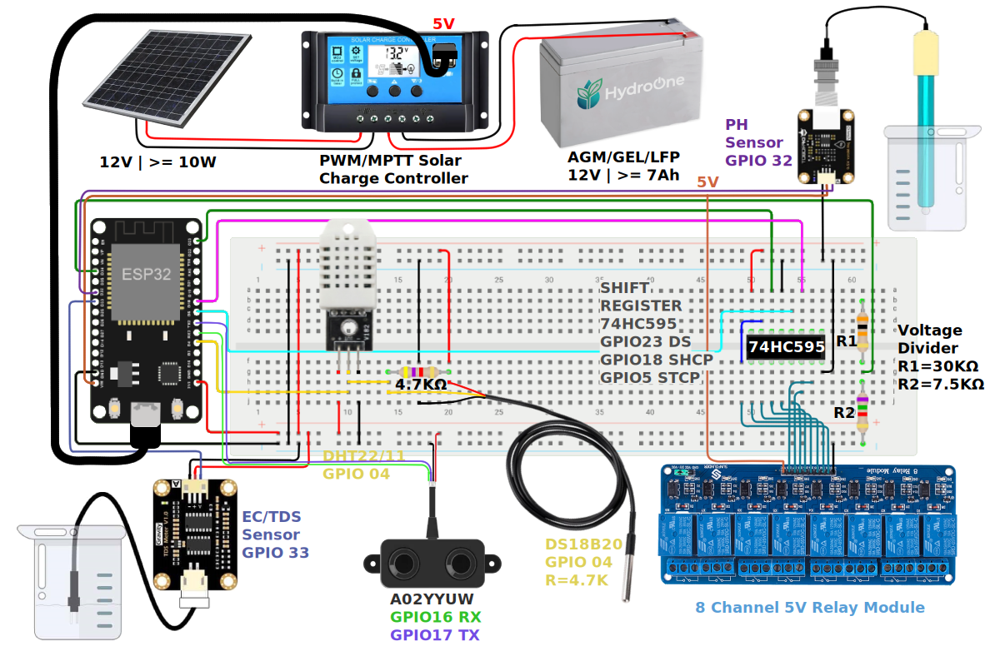
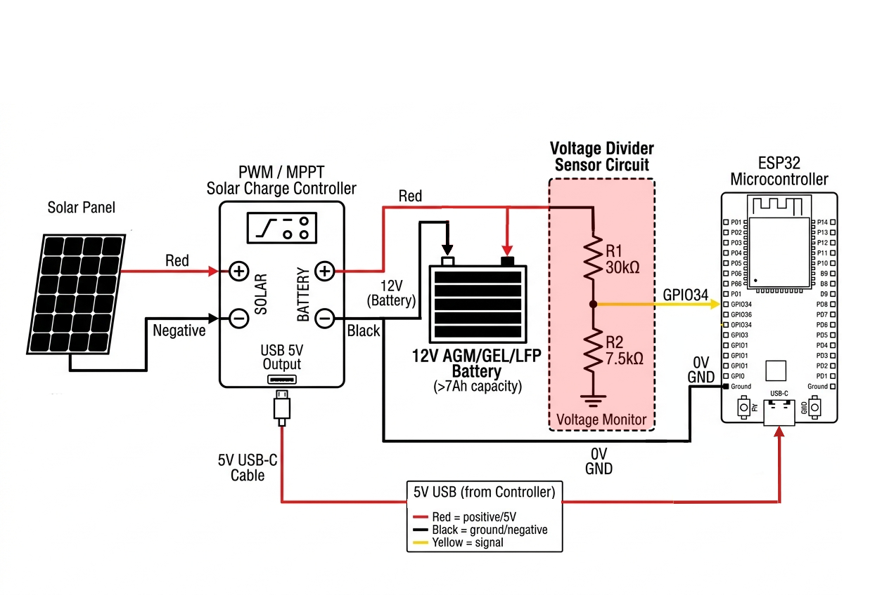
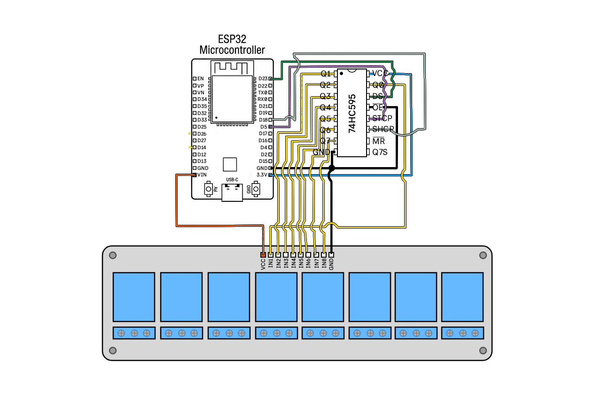

# Hardware Setup Guide

## 🔌 Complete Wiring Diagram



### ESP32 Connections

#### Power System


#### Sensor Connections

**DS18B20 (Water Temperature)**
```
DS18B20 Pin 1 (GND)  ──→ GND
DS18B20 Pin 2 (DATA) ──→ GPIO4 ──[4.7kΩ pull-up]── 3.3V
DS18B20 Pin 3 (VCC)  ──→ 3.3V
```

**DHT11/DHT22 (Air Temperature & Humidity)**
> **Note**: DHT11/DHT22 sensor has 4 pins, but only 3 are used. The 4th pin is NC (not connected). But DHT module has 3 pins, VCC, DATA, GND. The module has a built-in pull-up resistor, so you don't need to add one.
```
DHT11/DHT22 Pin 1 (VCC)  ──→ 3.3V
DHT11/DHT22 Pin 2 (DATA) ──→ GPIO4 ──[10kΩ pull-up]── 3.3V
DHT11/DHT22 Pin 3 (NC)   ──→ (not connected)
DHT11/DHT22 Pin 4 (GND)  ──→ GND
```

**BME280 / BMP280 (Pressure & Environment Sensor - I2C)**
```
BME280/BMP280 VCC  ──→ 3.3V
BME280/BMP280 GND  ──→ GND
BME280/BMP280 SCL  ──→ GPIO22 (or specific I2C clock pin)
BME280/BMP280 SDA  ──→ GPIO21 (or specific I2C data pin)
```

**TCA9548A I2C Multiplexer (Optional)**
```
TCA9548A VIN  ──→ 3.3V
TCA9548A GND  ──→ GND
TCA9548A SCL  ──→ GPIO22 (ESP32 SCL)
TCA9548A SDA  ──→ GPIO21 (ESP32 SDA)
TCA9548A SC0  ──→ BME280 SCL (Channel 0)
TCA9548A SD0  ──→ BME280 SDA (Channel 0)
TCA9548A SC1  ──→ OLED SCL (Channel 1)
TCA9548A SD1  ──→ OLED SDA (Channel 1)
...etc
```

**HC-SR04 / JSN-SR04T / A02YYUW (Ultrasonic Sensors)**
Choose the sensor that best fits your reservoir environment. 

> ⚠️ **FIRMWARE CONFIGURATION REQUIRED**
> Because these sensors use totally different protocols (Pulse vs UART), you **MUST** open `firmware/include/config.h` and explicitly set `#define ULTRASONIC_SENSOR_TYPE` to correctly match your hardware before building!

#### 1. JSN-SR04T (Recommended - Waterproof)
Best for humid/wet environments. Uses pulse-based Trig/Echo.
- **Trig**: GPIO13
- **Echo**: GPIO12 (via 3.3V divider)

**Note**: Requires 20µs trigger pulse (handled by firmware).

#### 2. HC-SR04 (Standard)
Best for dry testing/enclosures. Uses pulse-based Trig/Echo.
- **Trig**: GPIO13
- **Echo**: GPIO12 (via 3.3V divider)

**Note**: Max distance ~200cm in this system.

**Voltage divider** for ECHO → 3.3V GPIO

>If ECHO is 5V, use a simple resistor divider to reduce to ~3.3V.

>R2/(R1+R2) = 2/3 → 5V × 2/3 ≈ 3.33V. Use modest resistor values (e.g., 1kΩ/2kΩ or 10kΩ/20kΩ) to keep input rise time fast; avoid very large values.

#### 3. A02YYUW (High Precision - UART)
Excellent waterproof sensor with internal processing. Uses UART Serial communication for better reliability.
- **Sensor TX** ──→ **GPIO16 (ESP32 RX)**
- **Sensor RX** ──→ **GPIO17 (ESP32 TX)**
- **VCC**: 3.3V - 5V
- **GND**: GND

**Note**: Returns distance in millimeters. No blind spot issues like pulse sensors.

```
Wiring for A02YYUW:
A02YYUW Red (VCC)   ──→ 5V
A02YYUW Black (GND) ──→ GND
A02YYUW Yellow (TX) ──→ GPIO12 (RX)
A02YYUW White (RX)  ──→ GPIO13 (TX)
```

**Water Level Sensor (Analog) — Optional backup**

> Use only if the ultrasonic sensor is unavailable or unreliable (optional).

```
Sensor VCC ──→ 3.3V
Sensor SIG ──→ GPIO35 (ADC1_CH7)
Sensor GND ──→ GND
```

- Notes & calibration
> SIG must be connected to an ADC-capable pin (ADC1_CH7 on GPIO35 for ESP32).  
> Calibrate by reading raw ADC at known empty and full water heights, then map ADC → depth.  
> For a rectangular reservoir: Volume = Depth × Cross‑sectional Area. Use calibration points to convert depth → volume.

- Level vs reservoir volume (solutions)
> Reference sight/tube: Install a narrow tube connected to the reservoir; water level in tube equals reservoir level — mount sensor on tube for localized measurement.  
> Multiple short sensors: Place several short probes at different heights to get discrete level steps; compute volume from highest active probe.  
> Float switch on guide rod: Mechanically simple for a few setpoints.  
> Capacitive or resistive probe array: Longer probes or segmented probes provide continuous readings without mechanical parts.  
> Hydrostatic (submersible) pressure sensor: Measures depth directly; good for tall/deep reservoirs.  

**pH Sensor (Analog Probe)**
```
pH Probe Module VCC ──→ 5V
pH Probe Module GND ──→ GND
pH Probe Module OUT ──→ GPIO32 (ADC) via voltage divider to 3.3V max
```

**EC/TDS Sensor**
```
EC Sensor Module VCC ──→ 5V
EC Sensor Module GND ──→ GND
EC Sensor Module OUT ──→ GPIO33
```

---

## I2C Expansion & Displays

### TCA9548A I2C Multiplexer
If you have multiple sensors with the same I2C address or want to organize your bus, use the TCA9548A.

**Wiring:**
```
Multiplexer VIN  ──→ 3.3V
Multiplexer GND  ──→ GND
Multiplexer SCL  ──→ GPIO22 (ESP32 SCL)
Multiplexer SDA  ──→ GPIO21 (ESP32 SDA)

[Channel 0] SC0/SD0 ──→ Sensor 1 (SCL/SDA)
[Channel 1] SC1/SD1 ──→ Sensor 2 (SCL/SDA)
```

### 128x64 OLED Display (SSD1306/SH1106)
Adding a local display allows you to check pH and Temperature without opening the dashboard.

**Wiring:**
```
OLED VCC  ──→ 3.3V
OLED GND  ──→ GND
OLED SCL  ──→ GPIO22 (or TCA9548A Channel)
OLED SDA  ──→ GPIO21 (or TCA9548A Channel)
```

> Ensure you use a 3.3V compatible OLED or logic level shifters if using a 5V version to avoid damaging the ESP32.

---

#### Actuator Connections

## 5V Relay Modules (Pump & Device Control)

### Option 1: Using 74HC595 Shift Register (Recommended)

The shift register allows you to control **up to 32 relays** (with 4 chained 74HC595 chips) using only **3 GPIO pins**.

**Set in firmware:**
```cpp
#define USE_SHIFT_REGISTER true
```

**Relay ID Mapping (Shift Register Bit Positions):**
```
Relay Enum IDs:
├─ RELAY_MAIN_PUMP     = Bit 0
├─ RELAY_PH_UP         = Bit 1
├─ RELAY_PH_DOWN       = Bit 2
├─ RELAY_NUTRIENT_A    = Bit 3
├─ RELAY_NUTRIENT_B    = Bit 4
├─ RELAY_SEC_PUMP      = Bit 5
├─ RELAY_LIGHT         = Bit 6
├─ RELAY_FAN           = Bit 7
└─ (Add up to Bit 31 with additional 74HC595 chips)
```

**Wiring Diagram (Single 74HC595):**

```
74HC595 Shift Register:
├─ VCC      ──→ 5V
├─ GND      ──→ GND
├─ SER      ──→ GPIO23 (Data/DS)
├─ SRCLK    ──→ GPIO18 (Clock/SHCP)
├─ RCLK    ──→ GPIO05 (Latch/STCP)
└─ OE     ──→ GND (Optio | Active LOW - enables outputs)


Relay Module Connections (per output bit):
Relay Q0-Q7 ──→ Relay Module IN pins
Relay VCC  ──→ 5V
Relay GND  ──→ GND

Relay Output Wiring (Example - Main Pump):
Relay NO (Normally Open) ──┬─→ Pump (+)
Relay COM (Common)       ──┤
                           └─→ Battery/Power (+)

Pump (−) ──→ Battery/Power (−)
```

**Note:** Configure relay logic (Active HIGH/LOW) in firmware:
```cpp
#define RELAY_ACTIVE_LOW_MASK 0b10000001  // Bits set to 1 = Active LOW
```

---

### Option 2: Direct GPIO Control (Limited)

For **simple setups with 2-3 relays** only, use direct GPIO pins without a shift register.

**Set in firmware:**
```cpp
#define USE_SHIFT_REGISTER false
```

**GPIO Pin Assignments:**
```cpp
#define MAIN_PUMP_RELAY 26
#define PIN_RELAY_PUMP1 25
#define PIN_RELAY_PUMP2 14
#define PIN_RELAY_PUMP3 27
#define PIN_RELAY_PUMP4 2
#define PIN_RELAY_LIGHT 19
#define PIN_RELAY_FAN   15
#define PIN_RELAY_AUX   0
```

**Wiring Diagram (Direct GPIO):**
```
Relay Module 1 (Main Pump):
├─ VCC  ──→ 5V
├─ GND  ──→ GND
└─ IN   ──→ GPIO26

Relay Module 2 (Pump 1):
├─ VCC  ──→ 5V
├─ GND  ──→ GND
└─ IN   ──→ GPIO25

[Repeat for each relay module using assigned GPIO pins]

Relay Output Wiring (same for all):
Relay NO (Normally Open) ──┬─→ Device (+)
Relay COM (Common)       ──┤
                           └─→ Battery/Power (+)

Device (−) ──→ Battery/Power (−)
```

**Limitation:** Each relay requires a dedicated GPIO pin. ESP32 has 25 usable GPIOs, but reserve pins for other sensors. **Not recommended for more than 7 relays.**


⚠️ **IMPORTANT**: If using 12V pumps, connect pump between relay and battery, NOT through 5V regulator!

## 🔧 Component Specifications

### Power Budget Calculation

| Component | Voltage | Current (mA) | Notes |
|-----------|---------|--------------|-------|
| ESP32 (active) | 3.3V | 40-80 | WiFi active |
| ESP32 (sleep) | 3.3V | 0.005 | Deep sleep |
| DS18B20 | 3.3V | 1.5 | Conversion |
| DHT11/DHT22 | 3.3V | 2.5 | Measuring |
| BMP280/BME280 | 3.3V | 2.7 | Normal mode |
| HC-SR04/JSN-SR04T | 5V | 15 | Per ping |
| Relay (coil) | 5V | 70 | Per relay |
| Water Pump | 12V | 500-1000 | Depends on pump |
|

**Total (all on, no pump)**: ~200 mA  
**With pump**: ~1200 mA  
**Deep sleep**: <1 mA

### Recommended Components

**Power System:**
- Solar Panel: 10W (17V, 0.6A) minimum
- Battery: 12V >7Ah AGM/GEL or LiFePO4
- Charge Controller: PWM 10A with overcharge protection
- 5V Regulator: LM2596 buck converter (3A)

**Enclosure:**
- IP65 rated waterproof box
- Cable glands for sensor wires
- Vents for heat dissipation (if sealed)

## 📏 Sensor Placement Guidelines

### Water Temperature (DS18B20)
- **Location**: Submerged in nutrient reservoir
- **Depth**: Middle of water column
- **Waterproofing**: Use waterproof DS18B20 probe version
- **Cable**: Max 3m for reliable readings (without amplification)

### Air Temperature/Humidity (DHT11/DHT22)
- **Location**: Above plant canopy
- **Height**: 30-50cm above plants
- **Avoid**: Direct sunlight, water splashes
- **Airflow**: Good ventilation area

### Pressure (BMP280/BME280)
- **Location**: Inside dry electronics enclosure
- **Purpose**: Altitude compensation for calculations
- **Mounting**: Secure to prevent vibration

### Water Level
- **Location**: Inside reservoir
- **Mounting**: Vertical orientation
- **Calibration**: Note min/max ADC values when empty/full

### Ultrasonic (HC-SR04/JSN-SR04T/A02YYUW)
- **Location**: Above water surface, centered if possible.
- **Mounting**: Perpendicular to water (0° angle). Use a 3D-printed bracket or a PVC pipe holder to prevent moisture from reaching the pins (even if the probe is waterproof).
- **Distance**: 5-200cm from surface.
- **Avoid**: Installing directly above turbulent water or near a pump outlet where bubbles can cause false echoes.

> 🧊 **PRO TIP: Reservoir Temperature Management**
> Nutrient solution temperature is critical for healthy root growth and maintaining dissolved oxygen levels. 
> * **Heat Control**: Reservoirs can heat up rapidly inside a greenhouse. If possible, place the main reservoir **outside** the grow area in a shaded spot.
> * **Insulation**: Alternatively, bury the reservoir or use insulation (e.g., a pond liner with an insulated lid) to stabilize temperatures.
> * **Chillers**: If using a water chiller, ensure it is placed in a separate, well-ventilated space. Chillers exhaust a significant amount of hot air, which can overheat your plants if kept in the same room.

### pH Probe
- **Location**: Submerged in nutrient solution
- **Storage**: Keep in storage solution when not in use
- **Calibration**: Use pH 4.0, 7.0, 10.0 buffers
- **Cleaning**: Regular maintenance required

### EC Probe
- **Location**: Submerged in nutrient solution
- **Cleaning**: Rinse with distilled water after use
- **Calibration**: Use 1413 μS/cm standard solution

## 🔩 Assembly Instructions

### Step 1: Prepare Enclosure
1. Drill holes for cable glands
2. Mount ESP32 on standoffs
3. Install voltage regulator on heatsink
4. Secure relay module
5. Add terminal blocks for easy connections

### Step 2: Wire Power System
1. Connect solar panel to charge controller
2. Connect battery to charge controller
3. Add fuse (5A) between battery and regulator
4. Wire 5V regulator output to ESP32 and relays
5. Create voltage divider for battery monitoring
6. Test voltages before connecting ESP32

### Step 3: Connect Sensors
1. Wire I2C sensors (BMP280/BME280) - verify with I2C scanner
2. Connect OneWire sensors (DS18B20) with pull-up
3. Wire DHT11/DHT22 with pull-up resistor
4. Connect analog sensors to ADC pins
5. Wire HC-SR04/JSN-SR04T with voltage divider on echo pin
6. Label all wires clearly

### Step 4: Connect Actuators
1. Wire relay modules
2. Connect pumps to relay outputs
3. **SAFETY**: Add manual override switches
4. Install fuses on pump power lines
5. Test relay operation before connecting pumps

### Step 5: Test System
1. Power up without pumps connected
2. Monitor serial output for errors
3. Verify all sensors reading correctly
4. Test relay clicking (no pump load)
5. Connect pumps one at a time
6. Test MQTT connectivity
7. Verify deep sleep wake/resume

## 🛡️ Safety Considerations

### Electrical Safety
- ✅ Use fuses on all power lines
- ✅ Ensure proper wire gauge (18 AWG minimum for pumps)
- ✅ Waterproof all outdoor connections
- ✅ Add diodes across relay coils (flyback protection) / Or Use relay modules with built-in flyback protection

### Water Safety
- ✅ Waterproof all submerged sensors
- ✅ Use IP68 connectors for underwater cables
- ✅ Regular leak checks
- ❌ Keep electronics above water level

### Battery Safety
- ✅ Use charge controller with overcharge protection
- ✅ Add low-voltage disconnect
- ✅ Ensure proper ventilation (hydrogen gas)
- ✅ Use appropriate battery type (sealed AGM/GEL/LiFePO4)
- ❌ Never short circuit battery terminals

### Firmware Safety
- ✅ Implement emergency shutoffs
- ✅ Pump cooldown timers
- ✅ Sensor validation
- ✅ Watchdog timer
- ✅ Battery monitoring

## 🔍 Testing Checklist

### Power System
- [ ] Battery voltage reads correctly on GPIO34
- [ ] 5V regulator output stable under load
- [ ] Solar panel charging battery
- [ ] Deep sleep current < 1mA
- [ ] Wake from sleep successful

### Sensors
- [ ] DS18B20 reads realistic temperature
- [ ] DHT11/DHT22 reads reasonable values
- [ ] BMP280/BME280 pressure ~1013 hPa at sea level
- [ ] Water level sensor responds to changes
- [ ] Ultrasonic returns valid distances
- [ ] All sensors survive deep sleep cycle

### Connectivity
- [ ] WiFi connects on boot
- [ ] MQTT publishes successfully
- [ ] Commands received and executed
- [ ] WiFi reconnects after disconnect
- [ ] MQTT reconnects after broker restart

### Actuators
- [ ] Relay clicks audibly
- [ ] Pump runs when commanded
- [ ] Pump stops after timer expires
- [ ] Emergency stop works
- [ ] Cooldown timer prevents rapid cycling

### System Integration
- [ ] All sensors published via MQTT
- [ ] Commands control pump successfully
- [ ] System enters/exits sleep correctly
- [ ] Battery monitoring triggers warnings
- [ ] No memory leaks over 24 hours

## 📐 Calibration Procedures (Using Web Dashboard)

HydroOne features a seamless, remote calibration interface driven by MQTT. **You no longer need to hardcode values in C++!**

Navigate to the **`/calibration`** page on your HydroOne web dashboard to live-stream sensor readings and apply offsets securely over-the-air.

### Tank / Reservoir Calibration
1. Fix your ultrasonic sensor in place (see mounting instructions above). Empty your reservoir or let water settle completely.
2. Go to the Dashboard **Calibration** tab and select **Tank Settings**.
3. Select your tank geometry box (Rectangular/Cylindrical).
4. Enter the precise dimensions (Length, Width, Max Height) in cm (if you want to use the volume/litres calculation feature).
5. Click **"Auto-Calibrate Empty Depth"** to dynamically set the `empty_distance_cm` baseline using live ultrasonic telemetry.

### pH Sensor Calibration
1. Prepare 3 standard buffer solutions: **pH 4.0, 7.0, and 10.0**.
2. Rinse the probe thoroughly with distilled water.
3. Submerge the probe in the **pH 7.0** buffer and watch the live ADC reading on the dashboard stabilize.
4. Click **Capture Midpoint**.
5. Repeat the process for **pH 4.0** or **10.0** to calculate the acid/alkali slope.
6. Click **Save Calibration** — the parameters are instantly sent via MQTT and saved to the ESP32's non-volatile LittleFS storage!

### EC Sensor Calibration
1. Prepare your calibration solution (typically **1413 μS/cm** standard).
2. Rinse the probe with distilled water.
3. Submerge the probe in the solution until the raw ADC voltage stabilizes on the UI.
4. Enter `1.41` (mS/cm) in the reference input box.
5. Click **Calibrate EC**.
6. Store the probe clean!

## 🔄 Maintenance Schedule

### Daily (Automated)
- Battery voltage check
- Sensor validation
- MQTT heartbeat

### Weekly (Manual)
- Visual inspection of sensors
- Check water level
- Verify pump operation
- Review MQTT logs

### Monthly
- Clean sensors (gentle rinse)
- Check all connections
- Test emergency stop
- Verify calibration

### Quarterly
- Recalibrate pH probe
- Recalibrate EC sensor
- Replace worn components
- Update firmware if needed
