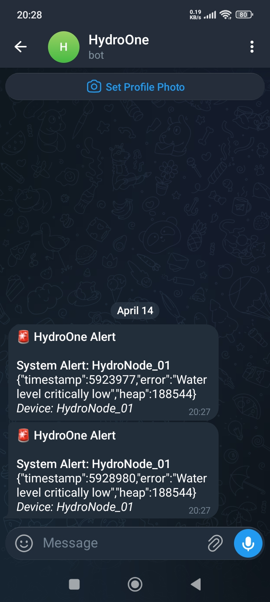

# System Integrations (HA, Node-RED, Telegram, Discord)

## 🏠 Home Assistant Integration

### MQTT Sensor Configuration

Add to your `configuration.yaml`:

```yaml
# Hydroponic System Sensors
mqtt:
  sensor:
    # Water Temperature
    - name: "Hydro Water Temperature"
      state_topic: "HydroOne/HydroNode_01/sensors/water/temperature"
      unit_of_measurement: "°C"
      device_class: temperature
      icon: mdi:thermometer-water
      
    # Air Temperature
    - name: "Hydro Air Temperature"
      state_topic: "HydroOne/HydroNode_01/sensors/air/temperature"
      unit_of_measurement: "°C"
      device_class: temperature
      icon: mdi:thermometer
      
    # Humidity
    - name: "Hydro Humidity"
      state_topic: "HydroOne/HydroNode_01/sensors/air/humidity"
      unit_of_measurement: "%"
      device_class: humidity
      icon: mdi:water-percent
      
    # Atmospheric Pressure
    - name: "Hydro Pressure"
      state_topic: "HydroOne/HydroNode_01/sensors/air/pressure"
      unit_of_measurement: "hPa"
      device_class: pressure
      icon: mdi:gauge
      
    # Water Level
    - name: "Hydro Water Level"
      state_topic: "HydroOne/HydroNode_01/sensors/water/level"
      icon: mdi:waves
      
    # Reservoir Distance
    - name: "Hydro Reservoir Distance"
      state_topic: "HydroOne/HydroNode_01/sensors/reservoir/distance"
      unit_of_measurement: "cm"
      icon: mdi:arrow-expand-vertical
      
    # pH Level
    - name: "Hydro pH"
      state_topic: "HydroOne/HydroNode_01/sensors/water/ph"
      icon: mdi:ph
      
    # EC Level  
    - name: "Hydro EC"
      state_topic: "HydroOne/HydroNode_01/sensors/water/ec"
      unit_of_measurement: "mS/cm"
      icon: mdi:lightning-bolt
      
    # Battery Voltage
    - name: "Hydro Battery"
      state_topic: "HydroOne/HydroNode_01/power/battery"
      unit_of_measurement: "V"
      device_class: voltage
      icon: mdi:battery
      
    # System Status JSON
    - name: "Hydro System Status"
      state_topic: "HydroOne/HydroNode_01/status"
      value_template: "{{ value_json.state }}"
      json_attributes_topic: "HydroOne/HydroNode_01/status"
      icon: mdi:water-pump

  # Pump Control Switch
  switch:
    - name: "Hydro Pump"
      state_topic: "HydroOne/HydroNode_01/status"
      value_template: "{{ value_json.pump }}"
      command_topic: "HydroOne/HydroNode_01/cmd/pump"
      payload_on: '{"action":"on","duration":30000}'
      payload_off: '{"action":"off"}'
      state_on: "on"
      state_off: "off"
      icon: mdi:water-pump
      
  # Binary Sensors
  binary_sensor:
    # Online Status
    - name: "Hydro System Online"
      state_topic: "HydroOne/HydroNode_01/status"
      value_template: "{{ value_json.status }}"
      payload_on: "online"
      payload_off: "offline"
      device_class: connectivity
```

### Lovelace Dashboard Card

```yaml
type: vertical-stack
cards:
  # Status Card
  - type: entities
    title: Hydroponic System
    entities:
      - entity: binary_sensor.hydro_system_online
        name: System Status
      - entity: sensor.hydro_system_status
        name: Mode
      - entity: switch.hydro_pump
        name: Water Pump
        
  # Environmental Sensors
  - type: glance
    title: Environment
    entities:
      - entity: sensor.hydro_water_temperature
        name: Water Temp
      - entity: sensor.hydro_air_temperature
        name: Air Temp
      - entity: sensor.hydro_humidity
        name: Humidity
      - entity: sensor.hydro_pressure
        name: Pressure
        
  # Water Quality
  - type: glance
    title: Water Quality
    entities:
      - entity: sensor.hydro_ph
        name: pH Level
      - entity: sensor.hydro_ec
        name: EC
      - entity: sensor.hydro_water_level
        name: Level
      - entity: sensor.hydro_reservoir_distance
        name: Distance
        
  # Power Status
  - type: gauge
    entity: sensor.hydro_battery
    name: Battery Voltage
    min: 10
    max: 14
    severity:
      red: 11
      yellow: 11.5
      green: 12
      
  # History Graph
  - type: history-graph
    title: Temperature History
    hours_to_show: 24
    entities:
      - entity: sensor.hydro_water_temperature
      - entity: sensor.hydro_air_temperature
```

### Automations

#### Low Battery Alert
```yaml
automation:
  - alias: "Hydro Low Battery Alert"
    trigger:
      - platform: numeric_state
        entity_id: sensor.hydro_battery
        below: 11.5
    action:
      - service: notify.mobile_app
        data:
          title: "Hydroponic System Alert"
          message: "Battery voltage low: {{ states('sensor.hydro_battery') }}V"
          
  - alias: "Hydro Critical Battery"
    trigger:
      - platform: numeric_state
        entity_id: sensor.hydro_battery
        below: 11.0
    action:
      - service: switch.turn_off
        entity_id: switch.hydro_pump
      - service: notify.mobile_app
        data:
          title: "CRITICAL: Hydro System"
          message: "Battery critical! Pump disabled."
```

#### Temperature Alerts
```yaml
  - alias: "Hydro High Water Temperature"
    trigger:
      - platform: numeric_state
        entity_id: sensor.hydro_water_temperature
        above: 30
    action:
      - service: notify.mobile_app
        data:
          title: "Hydro Temperature Alert"
          message: "Water temperature high: {{ states('sensor.hydro_water_temperature') }}°C"
```

#### pH Out of Range
```yaml
  - alias: "Hydro pH Alert"
    trigger:
      - platform: numeric_state
        entity_id: sensor.hydro_ph
        above: 6.8
      - platform: numeric_state
        entity_id: sensor.hydro_ph
        below: 5.3
    action:
      - service: notify.mobile_app
        data:
          title: "Hydro pH Alert"
          message: "pH out of range: {{ states('sensor.hydro_ph') }}"
```

#### Scheduled Watering
```yaml
  - alias: "Hydro Scheduled Watering"
    trigger:
      - platform: time
        at: "08:00:00"
      - platform: time
        at: "14:00:00"
      - platform: time
        at: "20:00:00"
    condition:
      - condition: numeric_state
        entity_id: sensor.hydro_water_level
        above: 1000  # Ensure water available
    action:
      - service: mqtt.publish
        data:
          topic: "HydroOne/HydroNode_01/cmd/pump"
          payload: '{"action":"on","duration":60000}'
```

## 📱 Native Notification Alerts (Telegram & Discord)

HydroOne supports built-in notification alerts directly from the system backend, so you don't necessarily need Node-RED for basic notifications. You can configure these directly in the HydroOne configuration dashboard.

<p align="center">

</p>

### Telegram Setup
1. Create a bot using [@BotFather](https://t.me/botfather) on Telegram and copy the `botToken`.
2. Find your `chatId` (you can use [@userinfobot](https://t.me/userinfobot) to get your ID).
3. In the HydroOne Configuration page, enable Telegram, enter your credentials, and click Save.

### Discord Setup
1. In your Discord server, go to Channel Settings -> Integrations -> Webhooks.
2. Create a new webhook and copy the `webhookUrl`.
3. In the HydroOne Configuration page, enable Discord, enter the URL, and click Save.

---

## 🔵 Node-RED Integration

### Flow 1: Data Logger

```json
[
  {
    "id": "mqtt_in",
    "type": "mqtt in",
    "topic": "HydroOne/HydroNode_01/sensors",
    "qos": "1",
    "broker": "mqtt_broker"
  },
  {
    "id": "json_parse",
    "type": "json"
  },
  {
    "id": "influxdb_out",
    "type": "influxdb out",
    "database": "hydroponics",
    "measurement": "sensors"
  }
]
```

### Flow 2: Smart Pump Control

**Logic**: Turn pump on when water level drops, but not if temperature is too high

```javascript
// Node-RED Function Node
var waterLevel = msg.payload.water.level;
var waterTemp = msg.payload.water.temperature;
var battery = msg.payload.power.battery;

// Check conditions
if (waterLevel < 1500 && waterTemp < 28 && battery > 11.5) {
    // Turn pump on for 30 seconds
    msg.payload = {
        action: "on",
        duration: 30000
    };
    msg.topic = "HydroOne/HydroNode_01/cmd/pump";
    return msg;
}

return null;  // Don't send anything
```

### Flow 3: Alert Dashboard

Create a dashboard with gauges and charts:

```javascript
// Dashboard configuration
{
  "widgets": [
    {
      "type": "gauge",
      "topic": "HydroOne/HydroNode_01/sensors/water/temperature",
      "min": 0,
      "max": 40,
      "label": "Water Temp"
    },
    {
      "type": "chart",
      "topic": "HydroOne/HydroNode_01/sensors/water/ph",
      "hours": 24,
      "label": "pH History"
    }
  ]
}
```

### Flow 4: Telegram Notifications

```javascript
// Telegram Bot Node Configuration
var msg = {
    payload: {
        chatId: YOUR_CHAT_ID,
        type: 'message',
        content: 'Alert: ' + msg.payload.error
    }
};

return msg;
```

## 📊 Grafana Dashboard

### InfluxDB Data Source Setup

1. Install InfluxDB
2. Create database:
```bash
influx
> CREATE DATABASE hydroponics
> USE hydroponics
```

3. Configure Node-RED to write to InfluxDB (see Flow 1 above)

### Grafana Panel Queries

**Water Temperature:**
```sql
SELECT mean("temperature") 
FROM "sensors" 
WHERE ("type" = 'water') 
AND $timeFilter 
GROUP BY time(5m) fill(linear)
```

**pH Level:**
```sql
SELECT mean("ph") 
FROM "sensors" 
WHERE $timeFilter 
GROUP BY time(5m)
```

**Battery Voltage:**
```sql
SELECT mean("battery") 
FROM "sensors" 
WHERE $timeFilter 
GROUP BY time(10m)
```

## 🔔 Alert Thresholds

### Recommended Alert Levels

| Parameter | Warning | Critical | Action |
|-----------|---------|----------|--------|
| Water Temp | >28°C | >32°C | Reduce light, add chiller |
| Air Temp | >30°C | >35°C | Increase ventilation |
| pH | <5.5 or >6.8 | <5.0 or >7.5 | Adjust pH |
| EC | <1.0 or >2.5 | <0.5 or >3.0 | Adjust nutrients |
| Battery | <11.5V | <11.0V | Check solar/charging |
| Water Level | <500 ADC | <200 ADC | Refill reservoir |

## 📱 Mobile Dashboard (HA Companion App)

Configure mobile app dashboard:

```yaml
# configuration.yaml
mobile_app:

# Actionable Notifications
automation:
  - alias: "Hydro Quick Actions"
    trigger:
      - platform: event
        event_type: mobile_app_notification_action
        event_data:
          action: hydro_pump_on
    action:
      - service: mqtt.publish
        data:
          topic: "HydroOne/HydroNode_01/cmd/pump"
          payload: '{"action":"on","duration":30000}'
```

## 🔐 Security Best Practices

### MQTT Security

1. **Enable Authentication:**
```bash
mosquitto_passwd -c /etc/mosquitto/passwd hydro_user
```

2. **Configure ACLs:**
```
# /etc/mosquitto/acls
user hydro_user
topic read HydroOne/#
topic write HydroOne/#
```

3. **Enable TLS:**
```
# mosquitto.conf
listener 8883
cafile /etc/mosquitto/certs/ca.crt
certfile /etc/mosquitto/certs/server.crt
keyfile /etc/mosquitto/certs/server.key
```

### Home Assistant Security

- Use strong passwords
- Enable 2FA
- Restrict external access
- Use VPN for remote access
- Regular backups

## 🎯 Advanced Integrations

### Voice Control (Alexa/Google)

```yaml
# Via Home Assistant Cloud or Nabu Casa
alexa:
  smart_home:
    filter:
      include_entities:
        - switch.hydro_pump
      include_domains:
        - sensor
```

**Commands:**
- "Alexa, turn on hydro pump"
- "Alexa, what's the hydro water temperature?"

### Calendar-Based Scheduling

```yaml
# Google Calendar Integration
calendar:
  - platform: caldav
    url: YOUR_CALDAV_URL
    calendars:
      - Hydroponic Schedule

automation:
  - alias: "Hydro Calendar Events"
    trigger:
      - platform: calendar
        entity_id: calendar.hydroponic_schedule
        event: start
    action:
      - service: mqtt.publish
        data_template:
          topic: "HydroOne/HydroNode_01/cmd/pump"
          payload: '{"action":"on","duration":{{ trigger.calendar_event.description }}}'
```

---

## ☁️ Free Cloud & Managed Services Tier Options

For teams and enthusiasts who want to deploy the HydroOne dashboard online globally without local homelab or server maintenance costs, we highly recommend taking advantage of "forever free" developer tiers offered by modern managed services.

### 🌐 Frontend & Node.js Backend Hosting
You do not need to pay for a VPS! The Fastify API and the React/Vite dashboard can be hosted at zero cost:
* **[Render.com](https://render.com/)**: Generous free tier for Node.js Web Services (perfect for `hydro-one-backend`) and excellent static site hosting for the frontend.
* **[Vercel](https://vercel.com/)** or **[Netlify](https://www.netlify.com/)**: Top-tier free platforms specifically optimized for deploying our React frontend natively.

### 🗄️ PostgreSQL Database
To securely store device records, configurations, and user accounts in the cloud:
* **[Neon.tech](https://neon.tech/)**: Serverless Postgres offering 1 free project, 3 GiB storage, and shared compute (perfect for IoT configurations).
* **[Supabase](https://supabase.com/)**: Managed PostgreSQL database with free quotas, including real-time capabilities and Row Level Security.
* **[Aiven](https://aiven.io/postgresql)**: Provides a very reliable free plan featuring 1 GB RAM, 5 GB storage, and 1 CPU.

### 📈 Time-Series Telemetry Database
For lightning-fast sensor graphs natively integrating with our Fastify backend:
* **[InfluxDB Cloud Serverless](https://cloud2.influxdata.com/signup)**: Excellent free-tier (No credit card needed). Supports 30 days of data retention for metrics/telemetry which perfectly matches HydroOne's high-frequency sensor writes without blowing quotas.

### 📡 Cloud MQTT Broker
If you don't want to run `mosquitto` locally for your ESP32:
* **[HiveMQ Cloud](https://www.hivemq.com/mqtt-cloud-broker/)**: The standard for IoT. Offers a free starter plan allowing up to 100 concurrent devices (more than enough for a HydroOne farm deployment).
* **[EMQX Cloud Serverless](https://www.emqx.com/en/cloud/serverless)**: Another fantastic, fully managed cloud MQTT broker with 1 million free session minutes per month.

---

**Integration Level**: Beginner to Advanced  
**Setup Time**: 1-3 hours depending on platform  
**Maintenance**: Minimal once configured